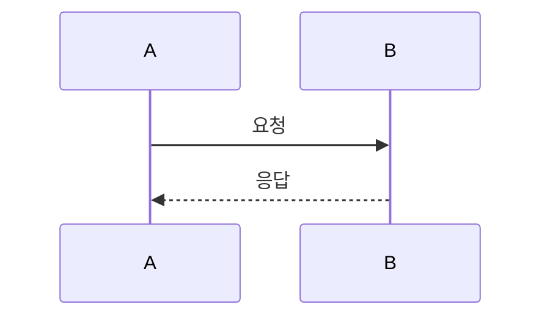
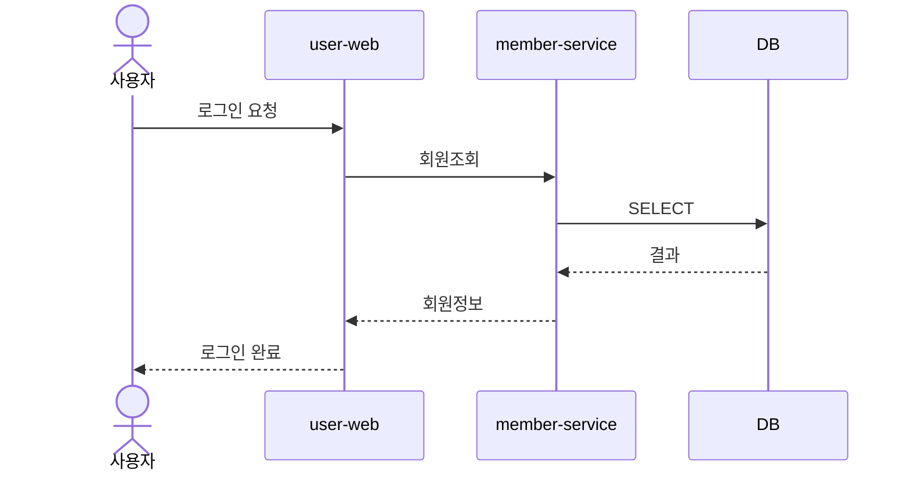
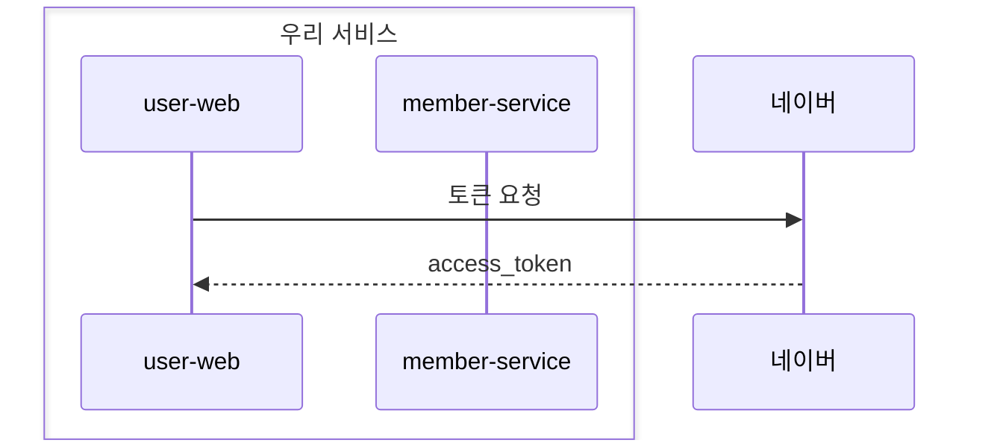
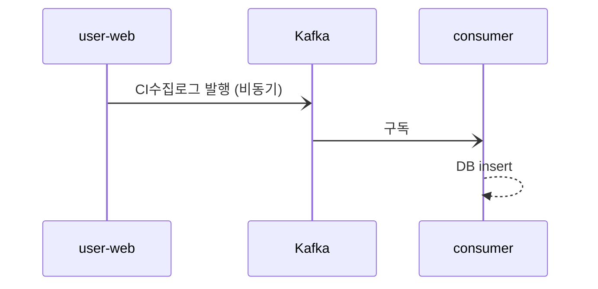
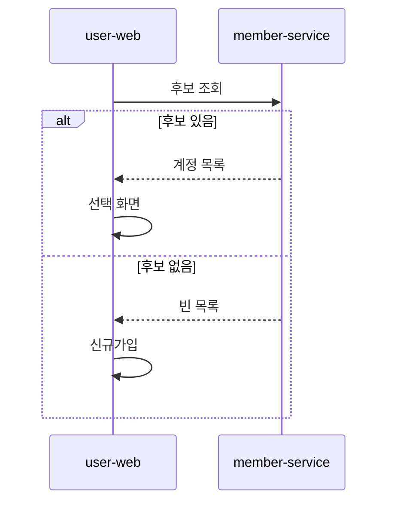
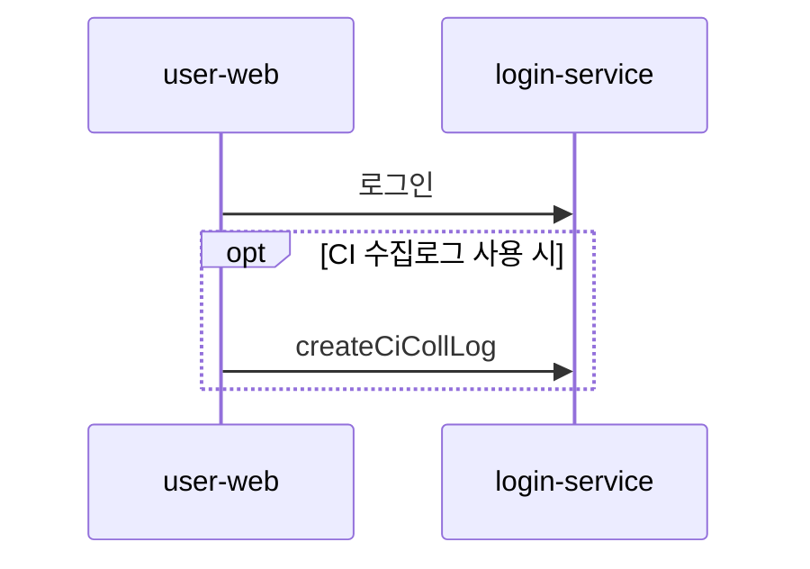
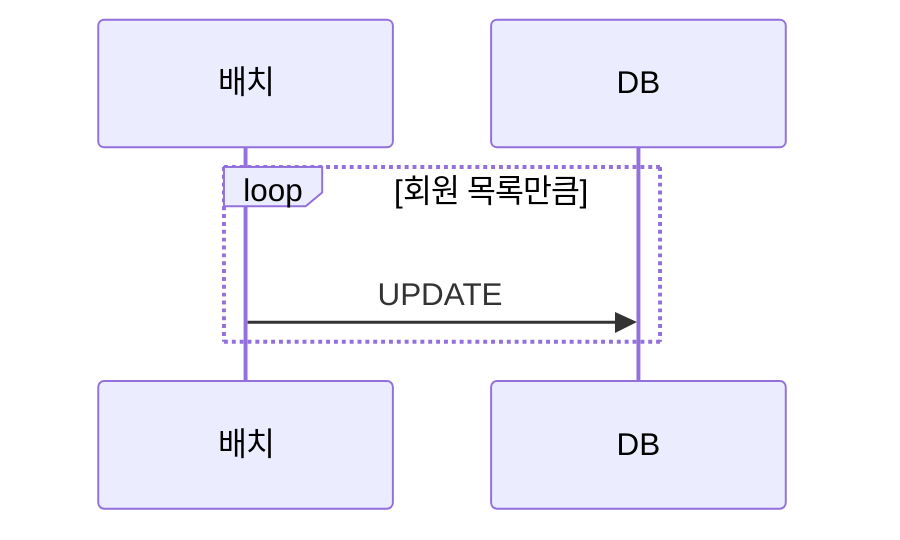
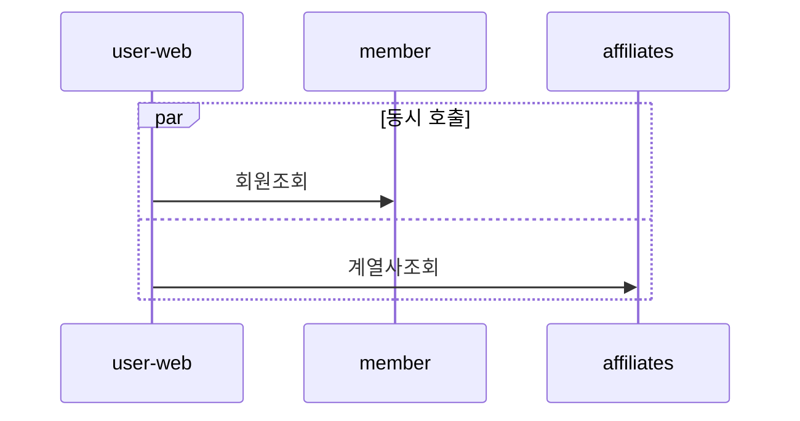
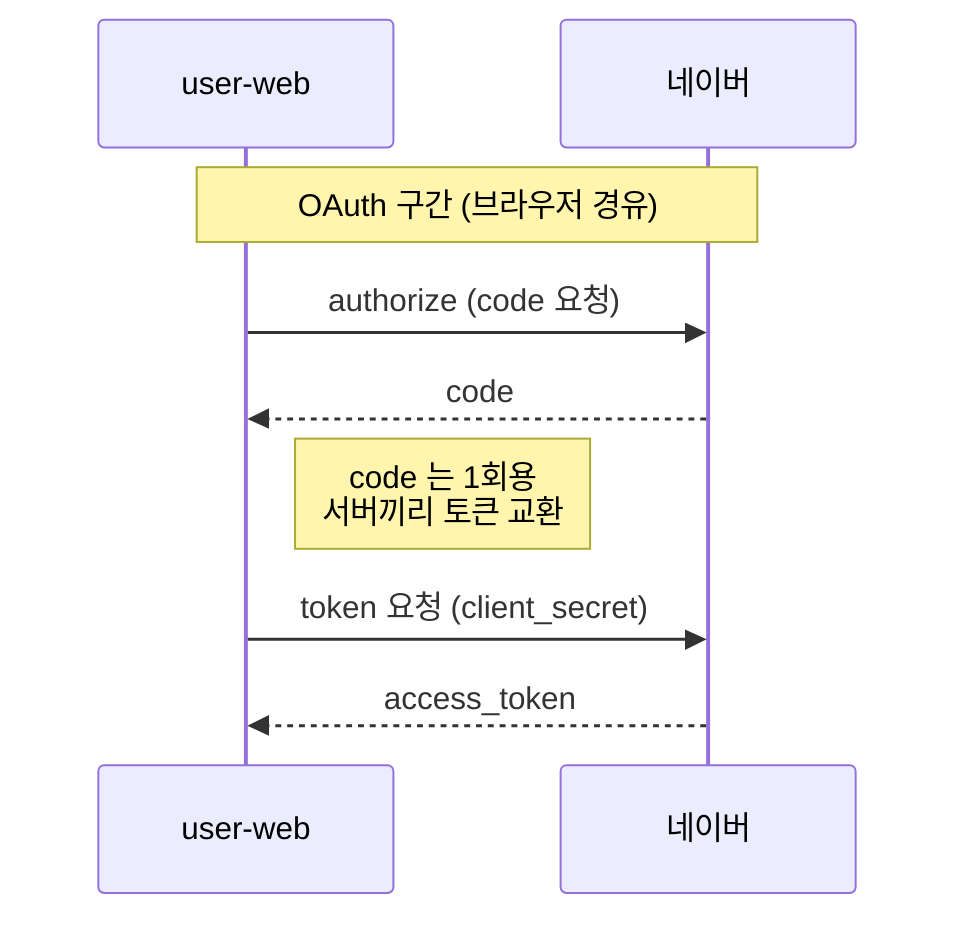
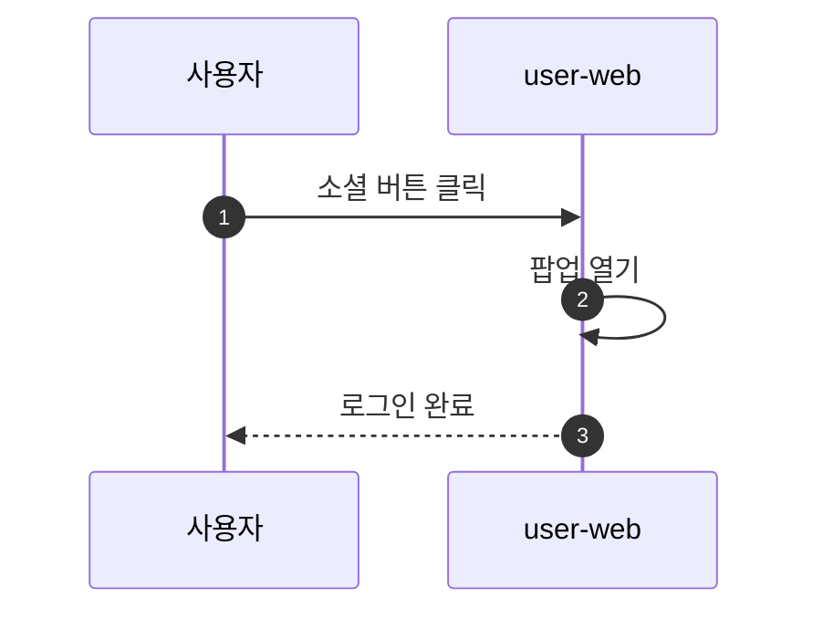

# Mermaid 시퀀스 다이어그램 정리

- 작성일: 2026-08-05
- 대상: md 문서에 흐름도를 그릴 때 쓰는 `mermaid` 의 `sequenceDiagram`
- 렌더링 환경: GitHub / GitLab / VS Code(미리보기) / IntelliJ(플러그인) / Notion 등이 ```` ```mermaid ```` 코드블록을 그림으로 그려준다. **렌더링 안 되는 뷰어에서는 그냥 코드로 보인다.**
- 이 문서는 항목마다 **소스 → 결과** 순서로 짝지어 놓았다. 렌더링되는 뷰어에서 보면 "결과" 쪽이 그림으로 보인다.

---

## 1. 가장 기본

**소스**
````text

````

**결과**


- 첫 줄에 **`sequenceDiagram`** 을 쓴다.
- 형식은 **`보내는쪽 화살표 받는쪽: 메시지`**
- 참가자를 따로 선언하지 않으면 **등장 순서대로** 자동 생성된다.

---

## 2. 참가자 선언 (participant / actor)

순서를 정하거나 이름을 짧게 쓰고 싶을 때 미리 선언한다.

**소스**
````text

````

**결과**


| 문법 | 뜻 |
|--|--|
| `participant W as user-web` | 박스 모양 참가자. `W` 는 짧은 별칭, 화면에는 `user-web` 표시 |
| `actor U as 사용자` | 사람 모양 아이콘 |
| 선언 순서 | **화면 왼쪽→오른쪽 배치 순서**가 된다 |

- 별칭(`W`)을 쓰면 본문이 짧아진다. 별칭에 공백은 못 쓴다.

### box — 참가자 묶기

**소스**
````text

````

**결과**


---

## 3. 화살표 종류

| 문법 | 모양 | 주로 쓰는 곳 |
|--|--|--|
| `->>` | 실선 + 화살촉 | **요청**(가장 많이 씀) |
| `-->>` | 점선 + 화살촉 | **응답** |
| `->` | 실선, 화살촉 없음 | 단순 연결 |
| `-->` | 점선, 화살촉 없음 | 단순 연결(응답성) |
| `-x` | 실선 + X | 비동기 발행(응답 안 기다림) |
| `--x` | 점선 + X | 비동기 |
| `-)` | 실선 + 열린 화살촉 | 비동기 호출(최신 문법) |
| `--)` | 점선 + 열린 화살촉 | 비동기 |

**소스**
````text

````

**결과**


- 자기 자신에게 보내면(`C-->>C`) 루프백으로 그려진다.

---

## 4. 그룹 (조건·반복·병렬)

| 블록 | 용도 | 짝 |
|--|--|--|
| `alt` / `else` | if-else 분기 | `end` |
| `opt` | 조건부(else 없음) | `end` |
| `loop` | 반복 | `end` |
| `par` / `and` | 병렬 | `end` |
| `critical` / `option` | 필수 처리 + 예외 | `end` |
| `break` | 중단(조기 종료) | `end` |

### alt / else — 분기

**소스**
````text

````

**결과**


### opt — 조건 만족 시에만

**소스**
````text

````

**결과**


### loop — 반복

**소스**
````text

````

**결과**


### par — 병렬

**소스**
````text

````

**결과**


---

## 5. 설명 붙이기 (Note)

| 문법 | 위치 |
|--|--|
| `Note right of A: 내용` | A 오른쪽 |
| `Note left of A: 내용` | A 왼쪽 |
| `Note over A: 내용` | A 위에 걸침 |
| `Note over A,B: 내용` | A~B 두 참가자에 걸침 |

- 줄바꿈은 **`<br/>`**

**소스**
````text

````

**결과**


---

## 6. 자주 쓰는 옵션

### autonumber — 자동 번호

**소스**
````text

````

**결과**


### activate / deactivate — 처리 구간 표시

`->>+` 로 활성화, `-->>-` 로 비활성화. 박스가 길어져 "처리 중" 구간이 보인다. (`activate M` / `deactivate M` 로 따로 써도 된다)

**소스**
````text
```mermaid
sequenceDiagram
    participant W as user-web
    participant M as member-service
    W->>+M: 회원조회
    M-->>-W: 결과
```
````

**결과**
```mermaid
sequenceDiagram
    participant W as user-web
    participant M as member-service
    W->>+M: 회원조회
    M-->>-W: 결과
```

### rect — 배경 강조

**소스**
````text
```mermaid
sequenceDiagram
    participant W as user-web
    participant A as apptest
    rect rgb(230, 240, 255)
    Note over W,A: 계열사 전달 구간
    W->>A: S13 (회원등록+매핑+약관)
    A-->>W: affMemCd
    end
```
````

**결과**
```mermaid
sequenceDiagram
    participant W as user-web
    participant A as apptest
    rect rgb(230, 240, 255)
    Note over W,A: 계열사 전달 구간
    W->>A: S13 (회원등록+매핑+약관)
    A-->>W: affMemCd
    end
```

---

## 7. 자주 겪는 함정

| 증상 | 원인 / 해결 |
|--|--|
| 그림이 안 나오고 코드로 보임 | 뷰어가 mermaid 를 지원하지 않음. GitHub·VS Code 미리보기에서 확인 |
| `Syntax error in graph` | 화살표 오타(`->>>`), `end` 누락, 콜론(`:`) 빠짐이 대부분 |
| 참가자 이름이 이상하게 잘림 | 별칭에 공백·특수문자 사용. `participant A as 이름` 형태로 쓸 것 |
| 메시지 줄바꿈이 안 됨 | 엔터가 아니라 **`<br/>`** 를 쓴다 |
| 메시지에 `;` `#` 쓰면 깨짐 | HTML 엔티티(`#59;`)로 쓰거나 문구를 바꾼다 |
| 메시지에 `|` 가 들어가면 | mermaid 자체는 괜찮지만 **md 표 안에서는 `\|`** 로 이스케이프해야 한다. 헷갈리면 `/` 로 대체 |
| 한글이 깨짐 | 파일 인코딩 UTF-8 확인. mermaid 자체는 한글 지원 |
| `alt` 안에 또 `alt` | 중첩 가능하나 깊어지면 읽기 어렵다 — 2단까지 권장 |
| 다이어그램이 너무 큼 | 참가자를 줄이거나 구간을 나눠 여러 다이어그램으로 |

### 문법 확인·이미지 내보내기
- **Mermaid Live Editor** (`mermaid.live`) — 웹에서 즉시 렌더링, 오류 위치 표시, **PNG/SVG 내보내기**
- **mermaid-cli** (`@mermaid-js/mermaid-cli`) — 명령줄로 이미지 변환. Confluence 등 미지원 환경에 붙일 때
- mermaid 는 **전용 확장자·전용 뷰어가 필요한 포맷이 아니다.** md 안의 코드블록 문법이고, 여는 도구가 JS 라이브러리로 그려준다.

---

## 8. 다른 다이어그램 종류 (참고)

| 종류 | 첫 줄 | 용도 |
|--|--|--|
| **sequenceDiagram** | `sequenceDiagram` | 시간 순서 호출 흐름 ← 이 문서 |
| flowchart | `flowchart TD` | 분기·프로세스 흐름 |
| classDiagram | `classDiagram` | 클래스 구조 |
| erDiagram | `erDiagram` | 테이블 관계(ERD) |
| stateDiagram-v2 | `stateDiagram-v2` | 상태 전이 |
| gantt | `gantt` | 일정 |

### ERD 예 — 테이블 관계

**소스**
````text
```mermaid
erDiagram
    TB_MEM ||--o{ TB_MEM_ACC : "1:N"
    TB_MEM_ACC ||--o{ TB_MEM_ACC_ID : "로그인수단"
    TB_MEM_ACC ||--o{ TB_MEM_SNS : "소셜연계"
```
````

**결과**
```mermaid
erDiagram
    TB_MEM ||--o{ TB_MEM_ACC : "1:N"
    TB_MEM_ACC ||--o{ TB_MEM_ACC_ID : "로그인수단"
    TB_MEM_ACC ||--o{ TB_MEM_SNS : "소셜연계"
```
